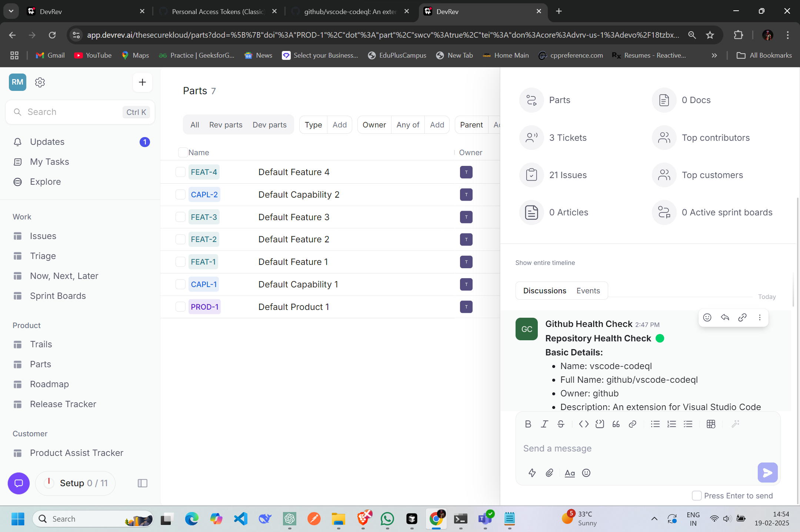

## GitHub Health Check Snap-In Implementation
[GitHub Health Check Demo Video](https://www.youtube.com/watch?v=0Ax48cxkpIo)

  <!-- Update the path as necessary -->

Our team has developed the "GitHub Health Check" Snap-In, which is implemented in the `index.ts` file located in the `code/src/functions/command_handler/` directory. This Snap-In automates the process of assessing the health of a GitHub repository and provides valuable insights directly within the DevRev ecosystem.

### Key Functionalities

1. **Extracting Repository Information**:
   - We utilize the `extractOwnerAndRepo` function to parse the GitHub repository URL and extract the owner and repository name. This approach supports various URL formats and ensures accurate data retrieval.

2. **Fetching Repository Details**:
   - The `getRepoDetails` function interacts with the GitHub API using the Octokit library to fetch essential repository details, including:
     - Number of open issues
     - Number of pull requests
     - Last commit date
     - Contributors
     - Other relevant metrics
   - Additionally, we calculate a health score based on various criteria, such as the presence of a description, the number of open issues, and community engagement metrics (forks and watchers).

3. **Generating Recommendations**:
   - Our Snap-In provides actionable recommendations based on the health score and repository metrics. For instance, it suggests adding a description if one is missing or enabling the Wiki feature for improved documentation.

4. **Creating Timeline Comments**:
   - The `createTimelineComment` function formats the repository health check results into a structured comment and posts it to the DevRev timeline. This includes:
     - Basic repository details
     - Health metrics
     - Recommendations
   - The comment is visually enhanced with emojis representing the health score.

5. **Handling Events**:
   - The `handleEvent` function is responsible for processing incoming events. It initializes the Octokit client with a GitHub personal access token and the DevRev SDK with a service account token. It retrieves the repository URL from the event payload and calls the necessary functions to fetch repository details and create a timeline comment.

6. **Running the Snap-In**:
   - The `run` function iterates over incoming events and processes each one using the `handleEvent` function, ensuring that multiple events can be handled in a single execution.

### Example Usage

To use the "GitHub Health Check" Snap-In, a developer or project manager can invoke the command with the following syntax:

```
/github_health_check OrgName RepoName
```

This command will trigger our Snap-In to fetch the health metrics of the specified GitHub repository and post the results to the DevRev timeline.

### Conclusion

The "GitHub Health Check" Snap-In, created by our team, streamlines the process of monitoring repository health, enabling developers and project managers to make informed decisions without the need for manual tracking. By integrating with both GitHub and DevRev, it enhances collaboration and repository management.
